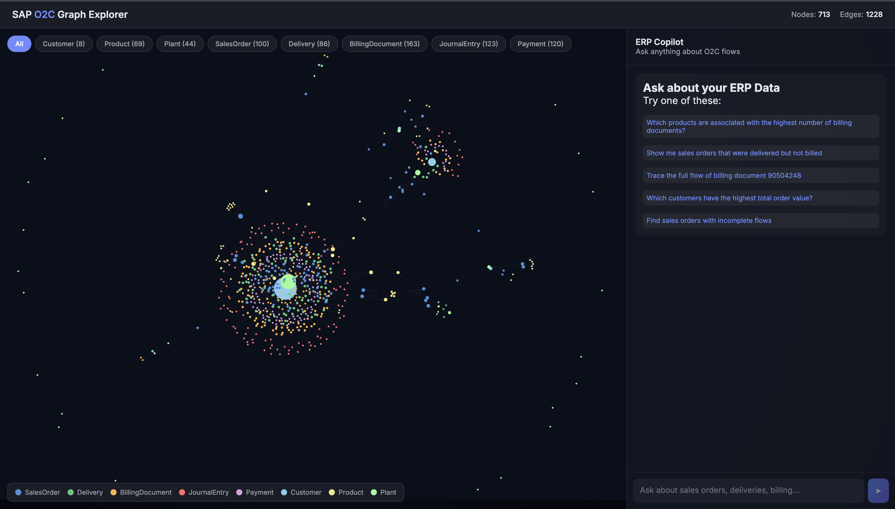

# SAP O2C Graph Explorer

A graph-based data modeling and natural language query system for SAP Order-to-Cash (O2C) data. Visually explore interconnected business entities and query the dataset using conversational language.


---



---

## Architecture

```
┌─────────────────────────────────────────────────────────────┐
│                      Frontend (React)                       │
│  ┌──────────────────────┐  ┌─────────────────────────────┐  │
│  │   Graph Visualization │  │    Chat Interface           │  │
│  │   (react-force-graph) │  │    (NL Query → Answer)      │  │
│  └──────────────────────┘  └─────────────────────────────┘  │
└──────────────────────────┬──────────────────────────────────┘
                           │ REST API
┌──────────────────────────┴──────────────────────────────────┐
│                    Backend (FastAPI)                         │
│  ┌────────────┐  ┌────────────┐  ┌────────────────────────┐ │
│  │  Graph API  │  │  Chat API  │  │    Guardrails          │ │
│  │  (NetworkX) │  │  (NL→SQL)  │  │    (Domain Filter)     │ │
│  └──────┬─────┘  └─────┬──────┘  └────────────────────────┘ │
│         │              │                                     │
│  ┌──────┴──────────────┴──────┐  ┌────────────────────────┐ │
│  │      SQLite Database       │  │   LLM (Ollama/Gemini)  │ │
│  │   (19 normalized tables)   │  │   (NL→SQL + Answer)    │ │
│  └────────────────────────────┘  └────────────────────────┘ │
└─────────────────────────────────────────────────────────────┘
```

## How It Works

1. **Data Ingestion** — Raw JSONL files are loaded into a normalized SQLite database on startup
2. **Graph Construction** — A NetworkX graph is built from the database, modeling the O2C flow as nodes and edges
3. **NL→SQL Pipeline** — User questions are translated to SQL by an LLM, executed against SQLite, then the results are summarized back in natural language
4. **Guardrails** — A two-layer filter (regex pre-filter + LLM system prompt) rejects off-topic queries

### Graph Model

```
Customer → Sales Order → Delivery → Billing Document → Journal Entry → Payment
                ↓              ↓
            Product          Plant
```

- **8 entity types** as nodes (~700 nodes, ~1200 edges)
- **Edges** represent business relationships (PLACED_ORDER, DELIVERED_VIA, BILLED_AS, etc.)
- **Node sizing** by degree — more connections = larger node

## Getting Started

### Prerequisites

- Python 3.11+
- Node.js 18+
- [Ollama](https://ollama.com) (for local LLM) **or** a [Google Gemini API key](https://aistudio.google.com/apikey) (free tier)

### 1. Clone and get the dataset

```bash
git clone https://github.com/<your-username>/Context-Graph.git
cd Context-Graph
```

The dataset (`sap-o2c-data/`) is not included in the repo. Place it in the project root before starting the backend. The folder should contain JSONL files organized by entity type (e.g. `sales_order_headers/`, `billing_document_items/`, etc.).

### 2. Backend setup

```bash
cd backend

# Create virtual environment
python3 -m venv venv
source venv/bin/activate   # On Windows: venv\Scripts\activate

# Install dependencies
pip install -r requirements.txt

# Configure environment
cp .env.example .env
```

Edit `backend/.env` with your config:

```env
# Option A: Ollama (free, local)
LLM_PROVIDER=ollama
OLLAMA_BASE_URL=http://localhost:11434
OLLAMA_MODEL=llama3

# Option B: Gemini (free tier, cloud)
# LLM_PROVIDER=gemini
# GEMINI_API_KEY=your_key_here

DATA_DIR=../sap-o2c-data
DB_PATH=sap_o2c.db
FRONTEND_URL=http://localhost:5173
```

If using Ollama, pull the model first:

```bash
ollama pull llama3
```

Start the backend:

```bash
python main.py
# Runs on http://localhost:8000
```

On first run, the database is built from the dataset. Subsequent starts use the cached `.db` file.

### 3. Frontend setup

```bash
cd frontend
npm install
npm run dev
# Runs on http://localhost:5173
```

Open [http://localhost:5173](http://localhost:5173) in your browser.

## API Endpoints

| Endpoint | Method | Description |
|----------|--------|-------------|
| `/api/health` | GET | Health check with graph stats |
| `/api/graph` | GET | Full graph data (nodes + links) |
| `/api/graph?center={nodeId}&depth=2` | GET | Subgraph around a node |
| `/api/graph?node_type={type}` | GET | Filter by node type |
| `/api/graph/node/{nodeId}` | GET | Node details + neighbors |
| `/api/graph/stats` | GET | Graph statistics |
| `/api/schema` | GET | Database schema description |
| `/api/chat` | POST | Natural language query |

## Example Queries

- "Which products are associated with the highest number of billing documents?"
- "Trace the full flow of billing document 90504248"
- "Show me sales orders that were delivered but not billed"
- "Which customers have the highest total order value?"
- "What is the average delivery time for each plant?"

## Deployment

The project includes a `Dockerfile` that bundles both frontend and backend into a single container, and a `render.yaml` for one-click deploy to [Render](https://render.com).

### Deploy to Render (free tier)

1. Push this repo to GitHub
2. Go to [render.com](https://render.com) and sign in with GitHub
3. Click **New > Web Service** and select this repo
4. Render auto-detects the `render.yaml` — confirm the settings
5. Add environment variables: `GEMINI_API_KEY`, `LLM_PROVIDER=gemini`, `FRONTEND_URL`
6. Deploy

> **Note:** Render free tier spins down after 15 min of inactivity. First request after sleep takes ~30s to cold-start.

### Deploy frontend to Vercel + backend to Render (alternative)

1. Deploy backend to Render as above
2. Import the repo on [vercel.com](https://vercel.com), set **Root Directory** to `frontend`
3. Add env var `VITE_API_URL=https://your-backend.onrender.com`
4. Update `frontend/vercel.json` to point rewrites at your Render backend URL

## Project Structure

```
├── backend/
│   ├── main.py           # FastAPI app, API endpoints
│   ├── database.py       # SQLite schema, data ingestion, indexes
│   ├── graph.py          # NetworkX graph construction, traversal
│   ├── llm.py            # LLM clients (Ollama/Gemini), NL→SQL pipeline
│   ├── guardrails.py     # Query relevance filtering
│   ├── requirements.txt
│   └── .env.example
├── frontend/
│   ├── src/
│   │   ├── App.jsx            # Main layout, state management
│   │   ├── components/
│   │   │   ├── GraphView.jsx  # Force-directed graph visualization
│   │   │   ├── ChatPanel.jsx  # Chat interface with sample queries
│   │   │   └── NodeDetail.jsx # Node metadata inspector
│   │   └── styles/App.css
│   ├── package.json
│   ├── vercel.json
│   └── vite.config.js
├── Dockerfile            # Full-stack container build
├── render.yaml           # Render deployment config
└── README.md
```

## Key Design Decisions

| Decision | Why | Tradeoff |
|----------|-----|----------|
| **SQLite** | Zero-config, single-file, great SQL support for LLM-generated queries | Not for concurrent writes at scale — fine for read-heavy analytics |
| **NetworkX (in-memory)** | Dataset is small (~700 nodes). Fast traversal, no extra infra | Wouldn't scale to millions of nodes — Neo4j for production |
| **Two-step LLM pipeline** (NL→SQL→NL) | Every answer is data-backed. LLM never fabricates data | Two LLM calls per query — acceptable latency tradeoff |
| **Ollama + Gemini** | Ollama = free local dev. Gemini free tier = free cloud deploy | Gemini free tier has rate limits |
| **Two-layer guardrails** | Regex pre-filter saves tokens. LLM catches subtle off-topic queries | Regex can be brittle — LLM layer is the real safety net |
